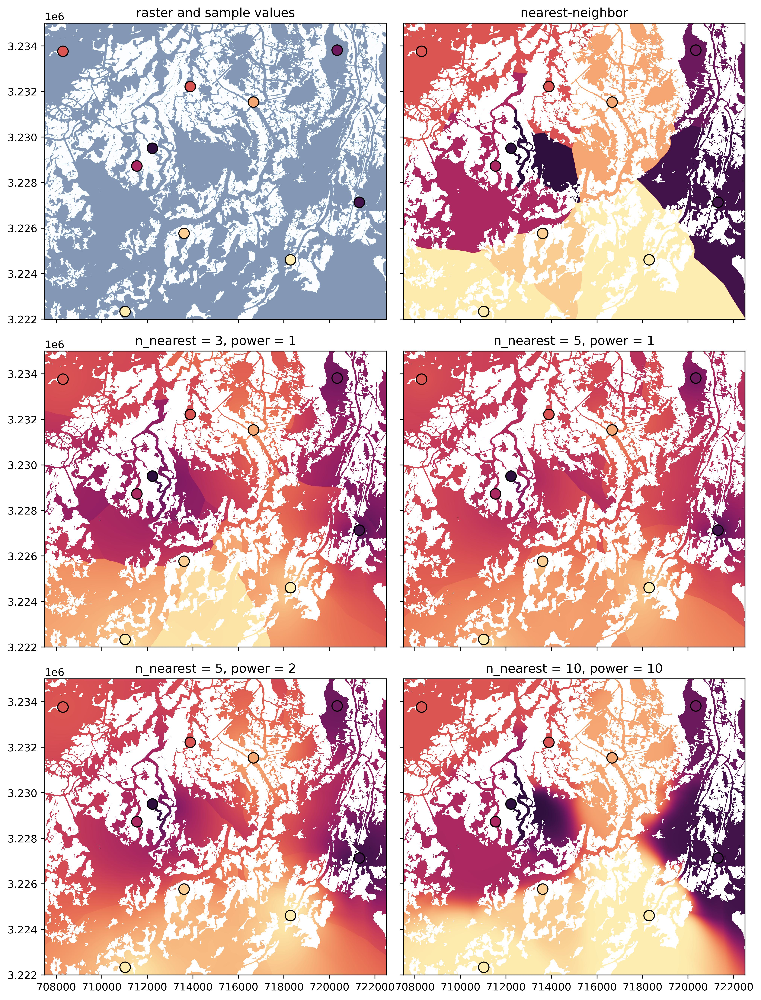

# Inverse Path-Distance Weighted Interpolation

`ipdw` is a Python package for performing [inverse-distance-weighted interpolation](https://en.wikipedia.org/wiki/Inverse_distance_weighting) using **path distances** instead of Euclidean distances. In other words, interpolation weights account for domain geometry and obstacles, which is often preferred in geophysical contexts in which "in water" distances are often more relevant to the process at hand than Euclidean distances. For example, this package allows you to quickly and easily interpolate inside a water body, accounting for complex coastlines, islands, and other barriers.

This package is inspired by [Stachelek & Madden (2015)](doi.org/10.1080/13658816.2015.1018833) and is a Python alternative to the original `R` package [`ipdw`](https://github.com/jsta/ipdw), although likely using different methodology under the hood. We rely heavily on the fast-marching approach of [`scikit-fmm`](https://github.com/scikit-fmm/scikit-fmm) to compute path distances, and rely exclusively on `matplotlib.path` and `numpy` to make sense of domain geometry information, which can be specified in either raster or vector format. _No geospatial packages are required._ Due to the use of fast-marching, vectorization, and a reliance on more efficient packages for the compututationally-expensive steps, this package should be quite fast and computationally efficient relative to the complexity of the underlying algorithm.

## Installation

Install the latest stable release from PyPi with pip:
```
pip install ipdw
```
If you want to install from source, clone this repository, navigate to the new directory, and run `python setup.py`.

**Requirements**: `numpy`, `matplotlib`, and `scikit-fmm`

## Background

The IPDW estimate for the value $V$ of at some location $(x,y)$ can be written:
$$V(x,y) = \frac{ \sum_{i} V_i \cdot d_i^{-P} }{ \sum_{i} d_i^{-P}}$$
for nearest locations $i = \[1:N\]$, and in which $V_i$ is the input value at location $i$, $d_i$ is the path distance to that location, $P$ is some positive exponent (often 1 or 2), and $N$ is the number of nearest locations to use in the weighting. The weight of each input point decreases for increasing distance away from that point, at a rate of $1/d^P$. If $N=1$, this is equivalent to nearest-neighbor interpolation.

## Example Usage

To use this package for interpolation, the user simply needs to provide domain geometry information and the locations/values of input data points. Domain geometry can be specified in one of two ways (i.e. vector or raster format). Regardless of input format, the output will be a raster array.

To specify domain geometry in **vector format**, the user needs to specify:
- The target `cellsize` of the output array.
- The domain `boundary`, specified as a `list` or `array` of $(x,y)$ points for each vertex along the boundary polygon, e.g. `[[x1,y1],[x2,y2],...,[xn,yn]]`. The length-scale used when specifying these coordinates should be equal to that used for the `cellsize`. If specified as an `array`, dimensions should be `(N,2)`.
- Optionally, any internal `holes` inside the domain (i.e. obstacles), specified as a `list` of holes, where each hole has the same input format requirements as `boundary`.

Then, an example `Gridded` object can be instantiated as follows:
```
import ipdw

cellsize = X
boundary = [[x1,y1],[x2,y2],...,[xn,yn]]
holes = [hole_1, hole_2, ..., hole_n]

grid = ipdw.Gridded(cellsize, boundary, holes)
```
Under the hood, this process creates a binary array of whatever size is needed to span the `boundary` coordinates at the requested `cellsize`, and then relies heavily on `matplotlib.path.Path` to query whether cell locations within that array are (1) inside the domain boundary and (2) not inside one of the specified holes. If a large number of holes are specified, this process may take a while. After the `Gridded` object has been initialized, the basemap used for interpolation is stored in the `grid.raster` attribute.

To specify domain geometry in **raster format**, the user needs to specify:
- A binary `raster` to be used as the basemap for interpolation (in other words, if this raster already exists, we do not need to create it). This raster must be binary (i.e. composed of 1's and 0's), and it will be converted to an integer array during initialization, so any `NaNs` should be set to 0. 
- The geospatial `extent` of that `raster` (i.e. the footprint), specified as `[xmin, xmax, ymin, ymax]`.

Then, an example `Gridded` object can be instantiated as follows (using `rasterio` as an example way in which one might access a basemap):
```
import ipdw
import rasterio

src = rasterio.open('path_to_file')
raster = src.read(1).astype(int)
extent = [src.bounds[0], src.bounds[2], src.bounds[1], src.bounds[3]]

grid = ipdw.Gridded(raster=raster, extent=extent)
```
Note that the combination of **either** (`cellsize`, `boundary`) **or** (`raster`, `extent`) is required to create a `Gridded` object, they cannot be mixed/matched. Also, if the former pair is specified, the latter will be ignored.

Regardless of which of the two options above was used, performing an interpolation looks the same. The user needs to specify:
- `input_locations` and `input_values` for the data between which we are interpolating
- Interpolation settings, most notably `n_nearest` (the number of nearest input data points used in the weighting) and `power` (the exponent $P$ above), as well as a few other optional parameters described in the function documentation.

Then, it is as simple as:
```
input_locations = [[x1,y1],[x2,y2],...,[xn,yn]]
input_values = [V1, V2, ..., Vn]

output = grid.interpolate(input_locations, input_values, n_nearest=3, power=1)
```
in which `output` is an array with interpolated values in all viable cells, and `NaN` everywhere else. That's it! 
Also, note that there exists another function, `Gridded.reinterpolate`, which can be used to perform additional interpolations using new `input_values` from the same locations (and with the same parameter settings), which is faster than re-running `interpolate`.

A few example interpolation outputs using different parameter choices are shown below.

<div class="nav3" style="width:800px;">
    </a>
</div>

## Contributing

Please feel free to open an issue or a pull request!
